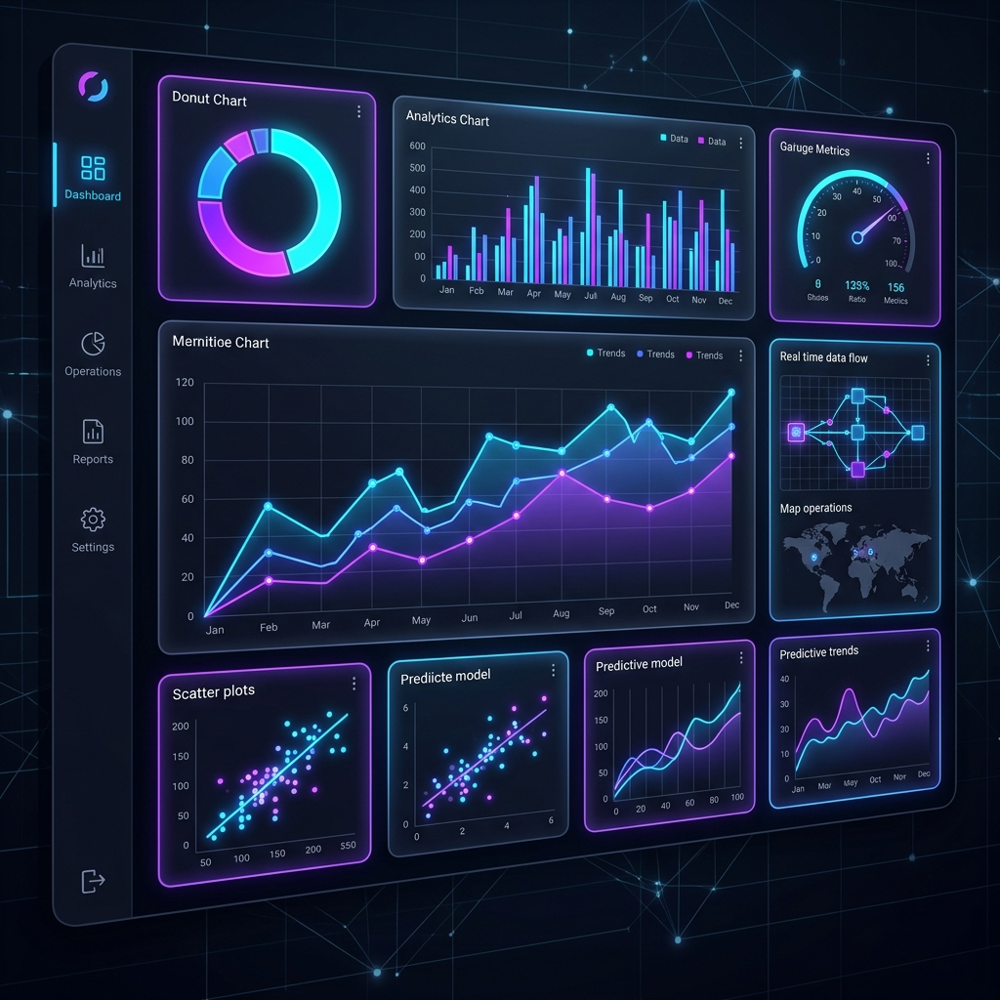
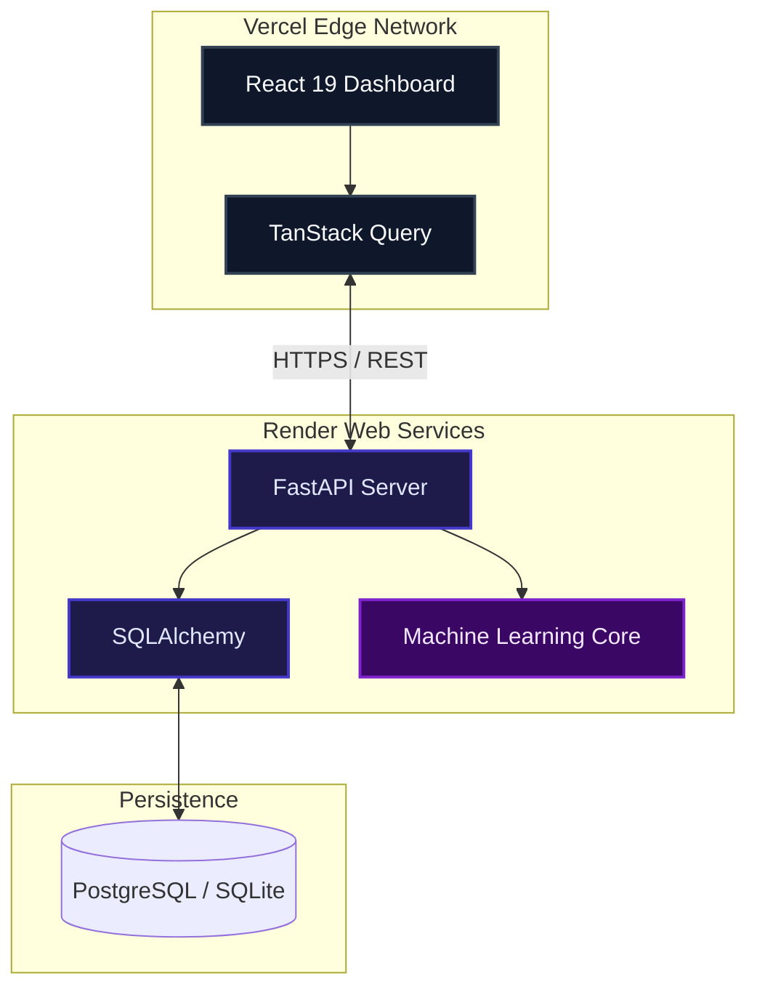
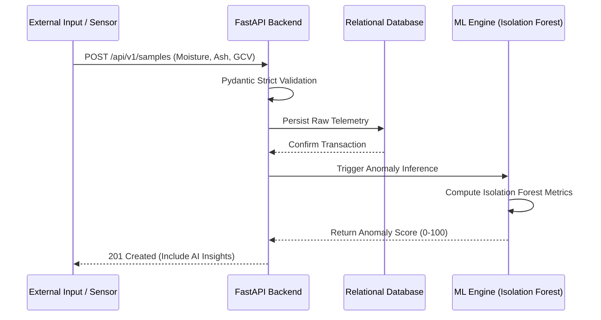

  

 

# CoalLab AI: Intelligent Quality Analytics & Blending Optimization

CoalLab AI is an enterprise-grade Machine Learning and Quality Analytics Platform engineered to modernize industrial coal quality assessment. By synthesizing real-time telemetry with predictive modeling and prescriptive analytics, the system automates anomaly detection, optimizes blending ratios, and provides actionable, data-driven insights for high-throughput coal processing facilities.

---

## Live Demo

Experience the live production application and the real-time AI inference capabilities deployed at the edge.

* **Frontend Production URL:** [https://analyzer-self.vercel.app](https://analyzer-self.vercel.app)
* **Backend API Gateway:** [https://coallab-api.onrender.com/api/v1](https://coallab-api.onrender.com/api/v1)

*(Note: The backend API runs on a serverless container that may spin down during inactivity; please allow 30-50 seconds for the initial cold boot.)*

---

## Tech Stack

The platform is designed around a decoupled, highly scalable service-oriented architecture utilizing a modern, type-safe stack.

### Frontend Application (Client)
* **React 19:** Optimized Single Page Application (SPA).
* **Vite:** High-performance bundling and Hot Module Replacement.
* **Tailwind CSS v4:** Strict dark-mode styling utilizing glassmorphism and modern UI components.
* **TanStack React Query:** Asynchronous server-state synchronization and caching.
* **Plotly.js:** High-density, multidimensional data visualization.
* **Lucide React:** Minimalist, consistent icon system.

### Backend Services (Server)
* **Python 3.12:** High-performance runtime.
* **FastAPI:** Asynchronous API routing and OpenAPI (Swagger) generation.
* **SQLAlchemy 2.0:** Object-Relational Mapping (ORM) and robust database transactions.
* **Pydantic v2:** Strict runtime data serialization and schema validation.
* **Scikit-Learn:** Core machine learning algorithms (Isolation Forest).
* **XGBoost:** Gradient boosting regression models.

---

## Deployment Architecture

Continuous Integration and Continuous Deployment (CI/CD) pipelines ensure zero-downtime provisioning across isolated environments. The frontend is pushed to a global edge network, while the backend is deployed as a scalable container.

**Architectural Flow:**
1. **Client Request:** The user interacts with the React Dashboard hosted on the Vercel Edge Network.
2. **State Management:** TanStack Query intercepts the request and issues an asynchronous HTTP payload to the backend.
3. **API Routing:** The FastAPI Gateway hosted on Render intercepts the payload and routes it for validation.
4. **Data Persistence / ML Inference:** The backend either queries the Database via SQLAlchemy or runs inference through the Machine Learning Core.

---

## Data Ingestion & Machine Learning Pipeline

The application ingests high-frequency coal quality metrics, validates the payloads through strict data contracts, and executes machine learning inferences synchronously to detect anomalous readings in real-time.

**Pipeline Explanation:**
1. **Ingestion:** Telemetry data is sent to the FastAPI backend.
2. **Validation:** Pydantic strictly enforces data types and constraints.
3. **Persistence:** The raw, unanalyzed data is saved to the database.
4. **Inference:** The data is forwarded to the `scikit-learn` Isolation Forest algorithm.
5. **Scoring:** The algorithm calculates an Anomaly Score (0-100) based on multidimensional feature relationships.
6. **Response:** The categorized data and scores are returned to the client dashboard.
