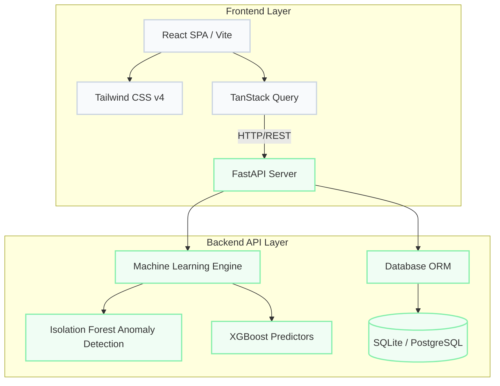

# CoalLab AI

CoalLab AI is an advanced Machine Learning and Quality Analytics Platform designed to modernize coal quality assessment. By integrating real-time data feeds with predictive modeling, CoalLab AI aims to detect anomalies, optimize blending ratios, and provide actionable insights into coal processing.

## System Architecture

The following diagram illustrates the high-level architecture of the CoalLab AI platform, separating the client-side dashboard from the server-side machine learning engine.



## Live Deployment

- **Frontend Dashboard:** [CoalLab AI Vercel Deployment](https://frontend-16thqsm9y-shekharsameer2308s-projects.vercel.app)
- **Backend API:** [CoalLab AI Render Endpoint](https://coallab-api.onrender.com/api/v1)

## Technology Stack

This repository is structured as a monorepo containing both the React presentation layer and the Python backend engine.

### Frontend
- **Framework:** React 19 + Vite
- **Styling:** Tailwind CSS v4
- **State Management & Fetching:** TanStack React Query, Axios
- **Visualization:** Plotly.js
- **Deployment:** Vercel

### Backend
- **Framework:** FastAPI (Python 3.12)
- **Database Management:** SQLAlchemy
- **Data Validation:** Pydantic
- **Deployment:** Render Web Services

## Local Setup and Installation

To run the platform locally, follow these instructions. Ensure you have Node.js (v18+) and Python (3.10-3.12) installed on your system.

### 1. Initialize the Backend API

Navigate to the backend directory, construct a virtual environment, and install the required dependencies:

```bash
cd backend
python -m venv venv

# Windows
venv\Scripts\activate
# Mac/Linux
# source venv/bin/activate

pip install -r requirements.txt
uvicorn app.main:app --reload --port 8000
```
The API will initialize and bind to `http://localhost:8000`.

### 2. Initialize the Frontend Dashboard

Open a separate terminal instance, navigate to the frontend directory, and start the development server:

```bash
cd frontend
npm install
npm run dev
```
The application will be accessible at `http://localhost:5173`.

## Database Seeding

To populate the database with an initial dataset of 50 generated coal samples, execute a POST request against the seed endpoint. 

For a local environment:
```bash
curl -X POST http://localhost:8000/seed
```

For the production environment:
```bash
curl -X POST https://coallab-api.onrender.com/seed
```

## Future Roadmap

1. **Phase 2:** Integrate Isolation Forest algorithms for automated anomaly detection regarding coal sample properties.
2. **Phase 3:** Deploy XGBoost models to predict Gross Calorific Value (GCV) utilizing moisture and ash content metrics.
3. **Phase 4:** Develop a Coal Blending Optimizer (utilizing Linear Programming and SciPy Optimize) to calculate recommended mixture ratios for target GCVs.
