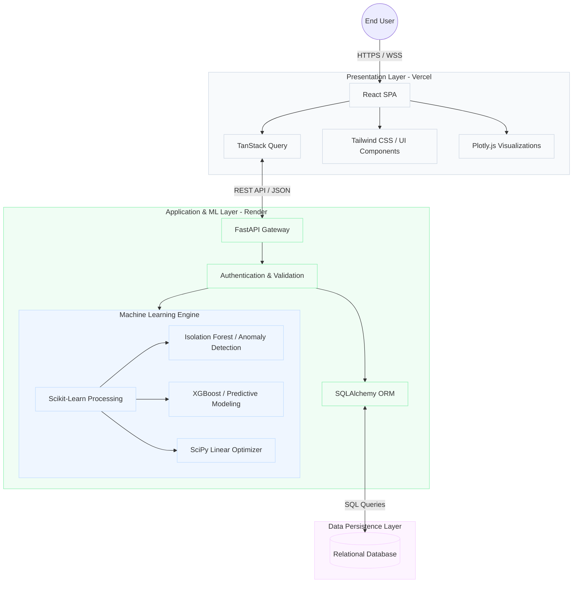

# CoalLab AI: Intelligent Coal Quality Analytics Platform

CoalLab AI is an enterprise-grade Machine Learning and Quality Analytics Platform architected to modernize coal quality assessment. By integrating real-time telemetry with advanced predictive modeling, the system facilitates automated anomaly detection, optimizes resource blending ratios, and delivers actionable, data-driven insights for industrial coal processing.

## System Architecture

The platform follows a decoupled, service-oriented architecture, distinguishing between a high-performance client presentation layer and a robust, scalable server-side machine learning engine.



## Production Deployment Environment

The system relies on cloud-native deployment pipelines to ensure high availability and continuous delivery.

- **Frontend Interface:** [CoalLab AI Production Dashboard](https://frontend-16thqsm9y-shekharsameer2308s-projects.vercel.app) (Hosted on Vercel Edge Network)
- **Backend Services:** [CoalLab AI API Endpoint](https://coallab-api.onrender.com/api/v1) (Hosted on Render Web Services)

## Comprehensive Technology Stack

This repository utilizes a monorepo structure to streamline continuous integration and deployment processes across both the frontend and backend boundaries.

### Client Presentation Layer
- **Core Framework:** React 19 functioning as a Single Page Application (SPA), bundled and optimized by Vite.
- **Styling Architecture:** Tailwind CSS v4 for utility-first, responsive, and systematic design implementation.
- **Data Synchronization:** TanStack React Query handles server state synchronization, caching, and background data fetching in tandem with Axios.
- **Data Visualization:** Plotly.js renders complex datasets into interactive, high-fidelity analytical charts.

### Server Application Layer
- **API Framework:** FastAPI running on Python 3.12, providing high-throughput, asynchronous endpoints and automatic OpenAPI documentation generation.
- **Data Persistence:** SQLAlchemy serves as the Object-Relational Mapper (ORM), abstracting interactions with underlying SQL databases (SQLite/PostgreSQL).
- **Data Validation:** Pydantic enforces strict type checking and serialization of incoming and outgoing API payloads.
- **Machine Learning Dependencies:** Scikit-Learn, XGBoost, Pandas, and NumPy power the predictive models and data transformations.

## Local Development Initialization

To instantiate the platform within a local development environment, proceed with the following configuration steps. Ensure the host machine possesses Node.js (v18.0.0 or greater) and Python (3.10 through 3.12).

### 1. Backend Service Configuration

Navigate to the `backend` directory to establish the isolated Python environment and initialize the FastAPI server.

```bash
cd backend
python -m venv venv

# Windows Activation
venv\Scripts\activate
# Unix/MacOS Activation
# source venv/bin/activate

pip install -r requirements.txt
uvicorn app.main:app --reload --port 8000
```
Upon successful execution, the backend service will bind to `http://localhost:8000`. 

### 2. Frontend Interface Configuration

In a parallel terminal session, navigate to the `frontend` directory to install package dependencies and launch the Vite development server.

```bash
cd frontend
npm install
npm run dev
```
The client interface will become accessible at `http://localhost:5173`.

## Database Initialization and Seeding

A newly initialized database requires seed data to populate the dashboard analytics. The system exposes an administrative endpoint to programmatically generate and insert 50 synthetic coal sample records.

To execute the seeding operation locally:
```bash
curl -X POST http://localhost:8000/seed
```

To execute the seeding operation against the production environment:
```bash
curl -X POST https://coallab-api.onrender.com/seed
```

## Strategic Roadmap and Iterations

The platform is subject to continuous iteration, specifically concerning its machine learning capabilities:

1. **Phase 2:** Deployment of Isolation Forest algorithms to automate the identification of statistical anomalies within routine coal sample properties, ensuring strict quality control.
2. **Phase 3:** Integration of trained XGBoost regression models to predict Gross Calorific Value (GCV) utilizing foundational metrics such as moisture and ash content.
3. **Phase 4:** Development of a programmatic Coal Blending Optimizer applying Linear Programming (via SciPy) to mathematically calculate the most efficient mixture ratios required to achieve target operational GCV specifications.
