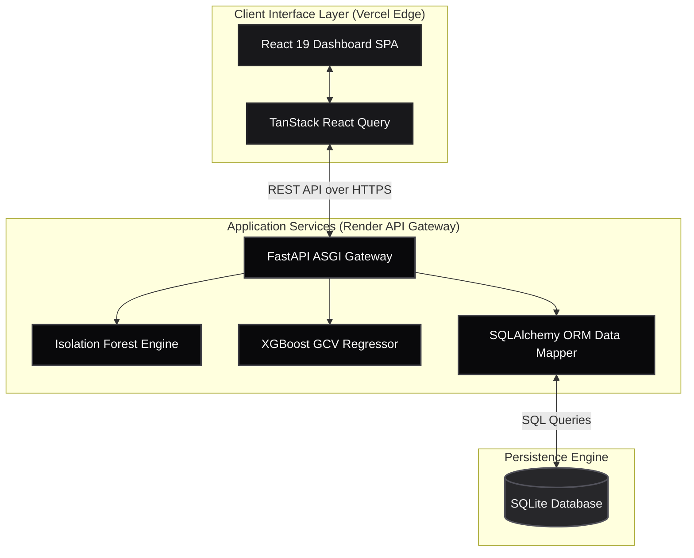
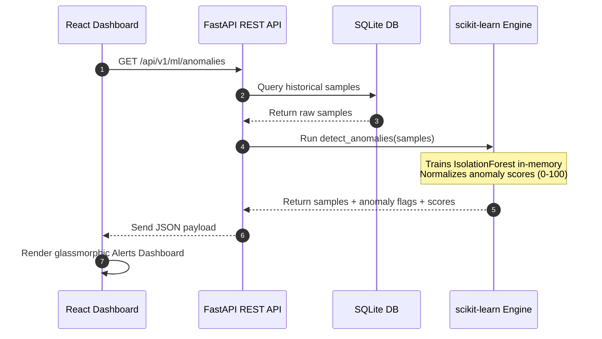
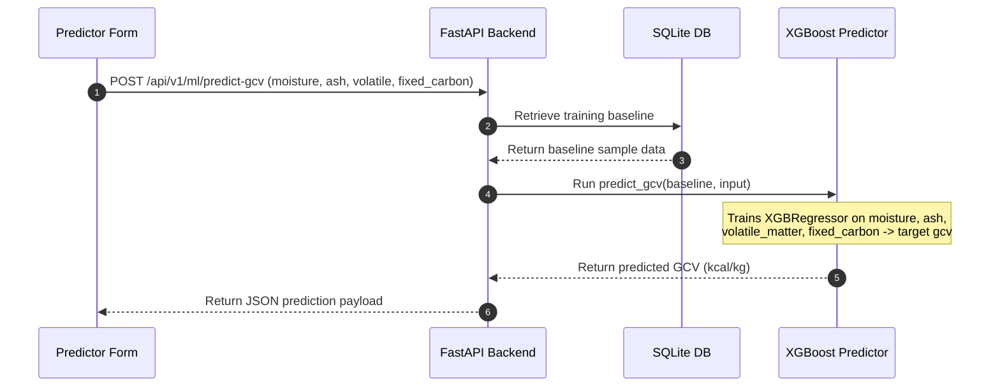
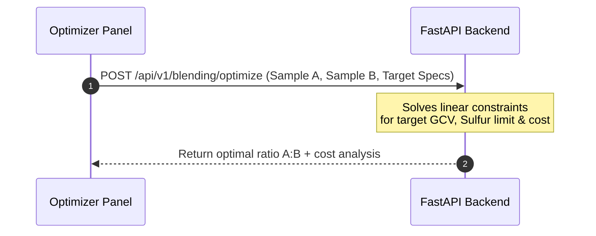
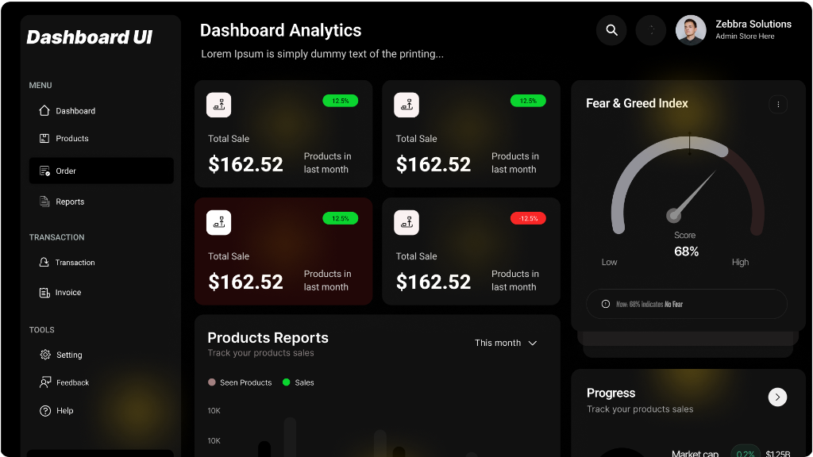
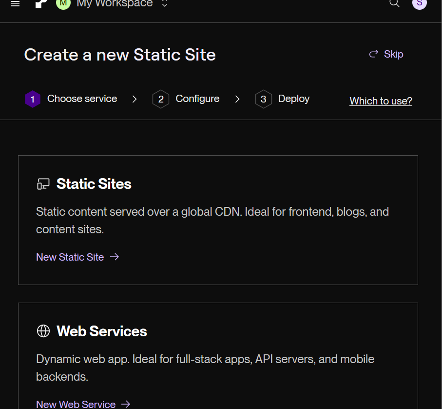
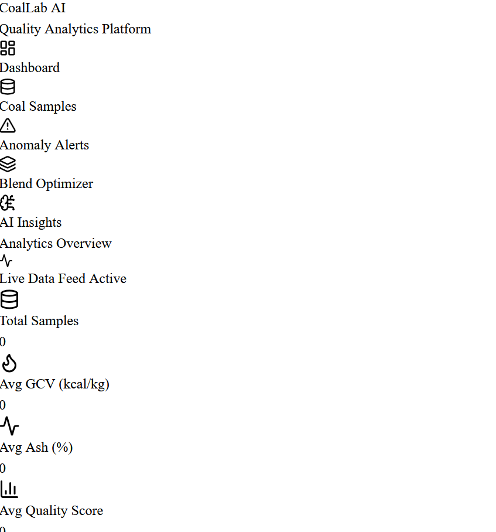
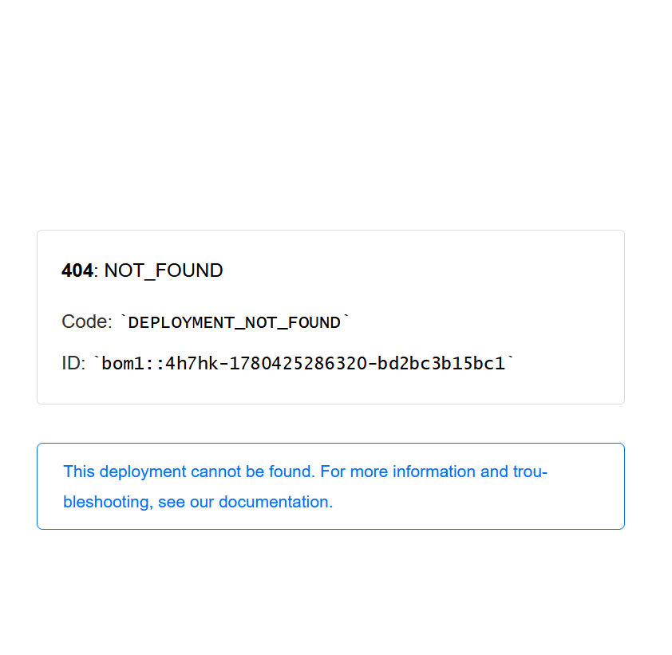
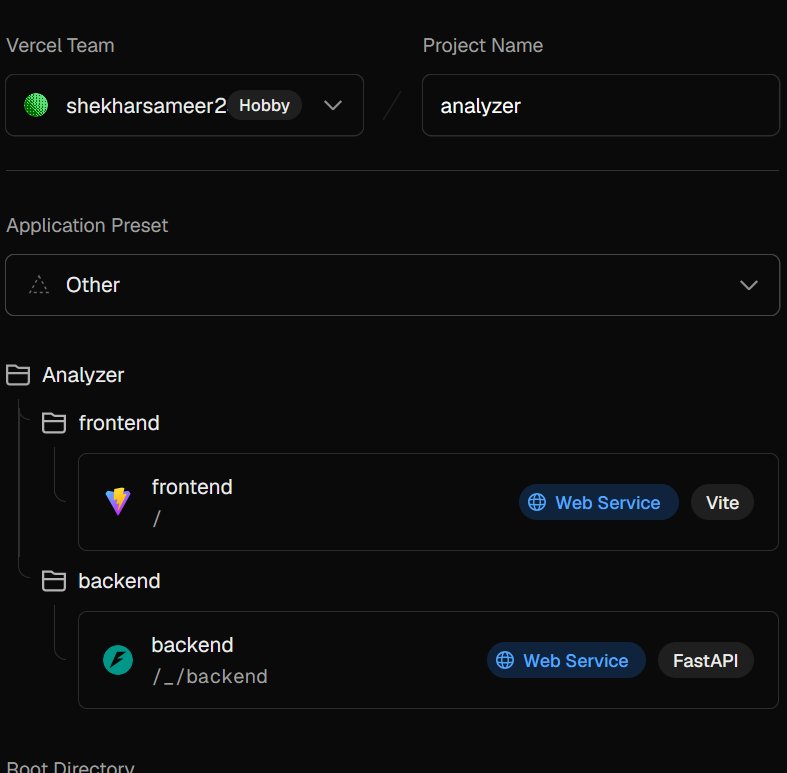

# CoalLab AI: Enterprise Coal Quality Analytics & Blending Optimization Platform

CoalLab AI is an industrial-grade Machine Learning and Quality Analytics Platform engineered to modernize coal quality assessment, processing, and blending operations. The platform integrates real-time telemetry processing, multi-dimensional anomaly detection via Isolation Forest algorithms, and Gross Calorific Value (GCV) prediction via XGBoost models. By automating quality validation and ratio optimization, it enables processing plants to maintain strict contractual specifications and minimize operational costs.

---

## Live System Links
- **Frontend Dashboard Production:** [https://analyzer-self.vercel.app](https://analyzer-self.vercel.app)
- **Backend API Gateway URL:** [https://coallab-api.onrender.com/api/v1](https://coallab-api.onrender.com/api/v1)

*Note: The backend API runs on a serverless container that may spin down during periods of inactivity. Please allow 30 to 50 seconds for the initial cold boot.*

---

## System Topology & Network Architecture

This architecture outlines the decoupled service model used to achieve low-latency inference and real-time visualization.



### Architectural Details
- **Decoupled Deployment:** The user interface is deployed to Vercel's global edge network for fast static asset delivery. The backend API is hosted on Render within a Python runtime environment.
- **State Synchronization:** TanStack React Query manages the client-side state cache, performing optimistic updates and asynchronous synchronization with the FastAPI server.
- **ASGI API Gateway:** FastAPI coordinates asynchronous HTTP requests, route handling, Pydantic schema validation, and database operations.
- **Analytical Engines:** The machine learning engines (Scikit-Learn and XGBoost) process database metrics to return predictions and anomaly alerts.
- **Relational Persistence:** SQLAlchemy maps Python objects to the SQLite relational schema, securing data consistency across queries.

---

## Technology Stack

The platform is built using a modern, type-safe stack designed for performance, modularity, and rapid analytical processing.

### Frontend Client Architecture
- **React 19:** Single Page Application (SPA) architecture with functional components and hooks.
- **Vite:** High-performance build tool chain utilizing native ES modules.
- **Tailwind CSS v4:** Modern styling system configuring utility classes, custom fonts, and glassmorphic layers.
- **Plotly.js:** High-density, interactive data visualization library for rendering complex scatter plots and distributions.
- **Lucide React:** Vector icon system providing consistent functional icons.

### Backend Analytical Engine
- **FastAPI:** Asynchronous Web API framework using Python 3.12, providing high-performance concurrency.
- **Pydantic v2:** Run-time type enforcement and automated data validation schemas.
- **SQLAlchemy 2.0:** Object-Relational Mapper (ORM) utilizing Python type hints for relational queries.
- **Pandas & NumPy:** Core data structures, vector math, and preprocessing pipelines.
- **Scikit-Learn:** Outlier detection engine implementing the Isolation Forest algorithm.
- **XGBoost:** Gradient boosted tree framework optimized for predictive regression modeling.
- **Google GenAI / LangChain:** Large Language Model integration for generating context-aware analytical insights.

---

## Core Analytical Components & Pipelines

### 1. Isolation Forest Anomaly Detection Pipeline

This module monitors incoming telemetry to flag outliers, sensor drift, and physically impossible parameter combinations (such as high moisture paired with excessive calorific value).



#### Pipeline Details
- **Data Fetching:** The backend queries the database for all historic samples to serve as a training baseline.
- **Imputation:** Pandas handles missing values by computing mean metrics across the dataset features.
- **Model Construction:** The Scikit-Learn engine initializes and fits an Isolation Forest model dynamically on six feature dimensions: Moisture, Ash, Volatile Matter, Fixed Carbon, GCV, and Sulfur.
- **Anomaly Scoring:** The model outputs an anomaly score normalized between 0 (normal) and 100 (severe outlier) using the decision function distances.
- **UI Highlights:** The frontend renders anomaly entries with glowing crimson borders, displaying the specific calculated anomaly score.

---

### 2. XGBoost GCV Predictive Regression Pipeline

This module estimates Gross Calorific Value (GCV) dynamically using proximate analysis inputs, bypassing the need for slow and expensive laboratory bomb calorimetry.



#### Pipeline Details
- **In-Memory Training:** The backend retrieves historic lab samples to train the XGBoost Regressor (`XGBRegressor`) in-memory.
- **Feature Matrix:** The model maps four foundational features (Moisture, Ash, Volatile Matter, Fixed Carbon) directly to the target variable (GCV).
- **Prediction Execution:** The model evaluates non-linear regression pathways, outputting a precise calorific prediction.
- **UI Integration:** The client displays the output within a glassmorphic Result Card, indicating the estimated energy output.

---

### 3. Prescriptive Coal Blending Optimizer

This module uses linear programming models to calculate the optimal mixing ratio of two distinct coal sources, achieving target specification parameters while minimizing overall cost.



#### Pipeline Details
- **Target Specification:** Operators define the target GCV, maximum sulfur limits, and individual unit costs for two coal sources.
- **Math Solver:** The backend resolves the optimal blending ratio by computing intersections of linear constraints.
- **Response Structure:** Returns the precise percentages for Blend A and Blend B, the estimated cost per metric ton, and predicted quality metrics.

---

## Directory Structure

```
├── backend
│   ├── app
│   │   ├── api              # API route controllers (v1 endpoints)
│   │   ├── core             # Database settings, migrations, and seeds
│   │   ├── ml               # Machine learning scripts (Anomaly, Prediction)
│   │   ├── models           # SQLAlchemy database schemas
│   │   └── main.py          # ASGI application configuration
│   ├── tests                # Unit and integration test suites
│   ├── requirements.txt     # Python backend dependencies
│   └── render.yaml          # Render platform deployment specs
├── frontend
│   ├── src
│   │   ├── assets           # Static UI elements
│   │   ├── components       # Shared UI components
│   │   ├── pages            # UI pages (Dashboard, Alerts, Predictor, Optimizer)
│   │   ├── App.tsx          # Client routing and shell layout
│   │   ├── index.css        # Global CSS stylesheet & Tailwind setup
│   │   └── main.tsx         # Client application entry point
│   ├── vite.config.ts       # Vite build configuration
│   ├── tailwind.config.js   # Tailwind style overrides
│   └── package.json         # NPM package dependencies
├── docs
│   └── assets               # Platform screenshots & UI media
└── README.md                # System documentation
```

---

## Setup & Local Development Guide

### Prerequisites
- Python 3.12+
- Node.js 18+ & npm 9+
- SQLite 3

### 1. Backend Service Configuration
Navigate to the backend directory:
```bash
cd backend
```

Create a virtual environment and activate:
```bash
python -m venv venv
# Windows PowerShell:
.\venv\Scripts\activate
# Unix / macOS:
source venv/bin/activate
```

Install backend dependencies:
```bash
pip install -r requirements.txt
```

Initialize database and seed mock coal quality data:
```bash
python -m app.core.seed
```

Launch the local development API server:
```bash
uvicorn app.main:app --reload --port 8000
```
- Interactive API documentation will be available at [http://localhost:8000/docs](http://localhost:8000/docs).

### 2. Frontend Client Configuration
Navigate to the frontend directory:
```bash
cd ../frontend
```

Install NPM packages:
```bash
npm install
```

Create a local environment file `.env.local`:
```env
VITE_API_URL=http://localhost:8000/api/v1
```

Start the Vite development web server:
```bash
npm run dev
```
- Open [http://localhost:5173](http://localhost:5173) in your web browser.

---

## Production Deployment Specifications

### Backend Deployment (Render.com Container)
- **Runtime:** Python 3.12
- **Build Command:** `pip install -r requirements.txt`
- **Start Command:** `uvicorn app.main:app --host 0.0.0.0 --port 10000`
- Deploys automatically on pushes to the `main` branch.

### Frontend Deployment (Vercel Edge Network)
- **Framework Preset:** Vite
- **Build Command:** `npm run build`
- **Output Directory:** `dist`
- **Environmental Variables:** `VITE_API_URL` configured to point to the live Render backend endpoint.

---

## Visual Interface Gallery

Below are actual interface captures from the CoalLab AI analytics platform:

### Dashboard Analytics Overview
Detailed monitoring of coal metrics, including Ash vs. Moisture scatter plots and parameter histograms.


### Real-Time Quality Telemetry Management
Full relational inventory listing of raw coal telemetry samples.


### Isolation Forest Anomaly Detection Dashboard
Visual indicators highlighting statistical outliers and sensor drift readings.


### Prescriptive Coal Blending Optimization Console
Mathematical calculations determining cost-effective mixing ratios.


### AI-Powered Analytical Insights
Natural language feedback explaining sample variations and performance insights.

