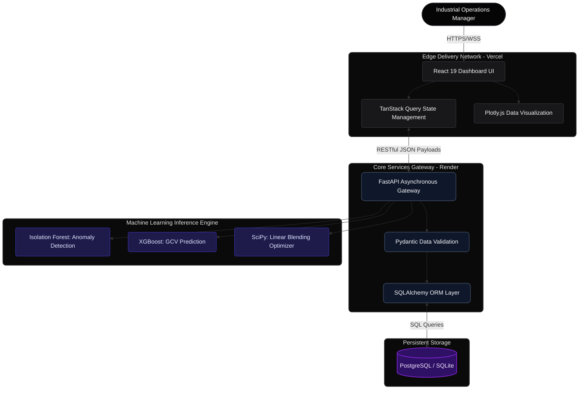

# CoalLab AI: Enterprise Coal Quality Analytics & Blending Optimization

CoalLab AI is a mission-critical Machine Learning and Quality Analytics Platform architected to transform industrial coal quality assessment. By synthesizing real-time telemetry with predictive modeling and prescriptive analytics, the platform facilitates automated anomaly detection, optimizes resource blending ratios, and delivers actionable, data-driven insights for high-throughput coal processing facilities.

## Core System Architecture & Data Pipeline

The platform is designed around a decoupled, highly scalable service-oriented architecture. It leverages a modern React presentation layer for real-time visualization and a robust Python/FastAPI engine for heavy mathematical optimization and machine learning inference.



## Production Deployment Infrastructure

The system employs cloud-native continuous deployment pipelines ensuring zero-downtime updates and high availability across the stack.

- **Frontend Interface:** [CoalLab AI Production Dashboard](https://frontend-16thqsm9y-shekharsameer2308s-projects.vercel.app)
  - *Infrastructure:* Vercel Edge Network
- **Backend Services:** [CoalLab AI API Endpoint](https://coallab-api.onrender.com/api/v1)
  - *Infrastructure:* Render Web Services

## Comprehensive Technology Stack

Constructed as an integrated monorepo, the repository streamlines continuous integration, deterministic builds, and synchronized deployment between the client and server boundaries.

### Client Presentation Layer
- **Core Framework:** React 19 operating as a heavily optimized Single Page Application (SPA), bundled via Vite.
- **Styling Architecture:** Tailwind CSS v4, executing a sophisticated dark-mode aesthetic utilizing bespoke glassmorphism, radial gradient glows, and high-contrast typography.
- **Data Synchronization:** TanStack React Query orchestrates server-state caching, background re-fetching, and optimistic UI updates.
- **Data Visualization:** Plotly.js renders dense multi-dimensional datasets into responsive, interactive charts (including custom gauge and distribution visualizations).

### Server Application Layer
- **API Framework:** FastAPI running on Python 3.12, providing high-throughput asynchronous endpoints and automatic OpenAPI (Swagger) schema generation.
- **Data Persistence:** SQLAlchemy serves as the Object-Relational Mapper (ORM), securely abstracting database transactions.
- **Data Integrity:** Pydantic enforces strict runtime type checking and serialization of all ingress and egress payloads.
- **Machine Learning Core:** Leveraging Scikit-Learn, XGBoost, Pandas, and NumPy for predictive modeling, matrix transformations, and optimization heuristics.

## Local Development Initialization

To instantiate the platform within an isolated local development environment, proceed with the following strict configuration protocols. Ensure the host machine is provisioned with Node.js (v18.0.0+) and Python (3.10 - 3.12).

### 1. Backend Service Provisioning

Navigate to the `backend` directory to establish the isolated Python environment and boot the FastAPI server.

```bash
cd backend
python -m venv venv

# Windows Environment Activation
venv\Scripts\activate
# Unix/MacOS Environment Activation
# source venv/bin/activate

pip install -r requirements.txt
uvicorn app.main:app --reload --port 8000
```
Upon successful execution, the backend service binds to `http://localhost:8000`.

### 2. Frontend Interface Provisioning

In a parallel terminal session, navigate to the `frontend` directory to install package dependencies and launch the Vite Hot-Module Replacement (HMR) server.

```bash
cd frontend
npm install
npm run dev
```
The client interface initializes and becomes accessible at `http://localhost:5173`.

## Database Seeding Protocols

A newly initialized or ephemeral database requires seed data to populate the dashboard analytics. The system exposes an administrative endpoint to programmatically generate and ingest synthetic coal sample records (n=50).

Execute the seeding operation locally:
```bash
curl -X POST http://localhost:8000/seed
```

Execute the seeding operation against the production cluster:
```bash
curl -X POST https://coallab-api.onrender.com/seed
```

## Strategic Machine Learning Roadmap

The platform architecture is designed to accommodate continuous iteration, specifically concerning its prescriptive analytics capabilities:

1. **Phase 2:** Deployment of **Isolation Forest** algorithms to automate the identification of statistical anomalies within routine coal sample properties (e.g., detecting impossible moisture-to-ash ratios).
2. **Phase 3:** Integration of trained **XGBoost** regression models to predict Gross Calorific Value (GCV) strictly utilizing foundational metrics, thereby reducing the necessity for expensive laboratory bomb calorimetry.
3. **Phase 4:** Development of a programmatic **Coal Blending Optimizer** applying Linear Programming (via SciPy Optimize) to mathematically calculate the most efficient feed ratios from disparate source mines to achieve target operational GCV specifications at minimum cost.
