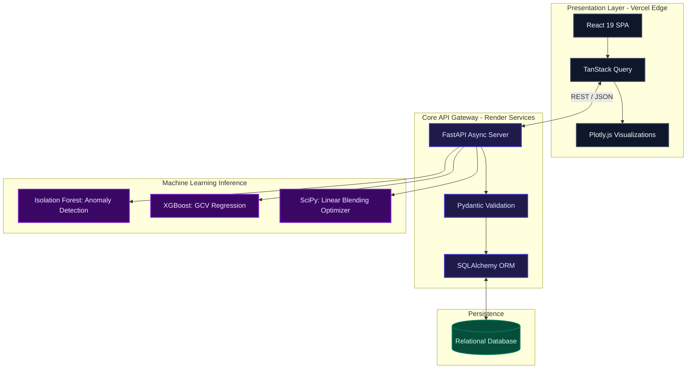
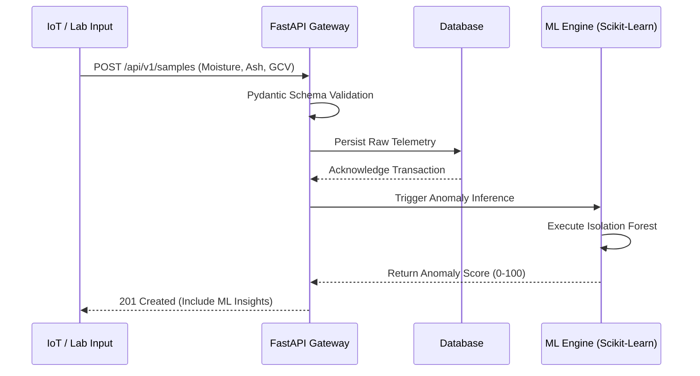

# CoalLab AI: Intelligent Quality Analytics & Blending Optimization

CoalLab AI is an enterprise-grade Machine Learning and Quality Analytics Platform engineered to modernize industrial coal quality assessment. By synthesizing real-time telemetry with predictive modeling and prescriptive analytics, the system automates anomaly detection, optimizes blending ratios, and provides actionable, data-driven insights for high-throughput coal processing facilities.

## System Architecture

The platform implements a decoupled, highly scalable service-oriented architecture. It integrates a React-based presentation layer for real-time visualization with a robust Python/FastAPI backend for high-performance mathematical optimization and machine learning inference.



## Data Ingestion & Machine Learning Pipeline

The application ingests high-frequency coal quality metrics, validates the payloads through strict data contracts, and executes machine learning inferences synchronously.



## Technology Stack Specifications

### Frontend Application (Client)
- **Framework:** React 19 (Single Page Application)
- **Build System:** Vite
- **Styling:** Tailwind CSS v4 (Strict dark-mode constraints, glassmorphism)
- **State Management:** TanStack React Query (Server-state synchronization)
- **Visualization:** Plotly.js (Multidimensional analytics rendering)

### Backend Services (Server)
- **API Framework:** FastAPI (Python 3.12, ASGI compliant)
- **Data Serialization:** Pydantic v2
- **ORM:** SQLAlchemy 2.0
- **Machine Learning Dependencies:** 
  - `scikit-learn` (Isolation Forest)
  - `xgboost` (Gradient Boosting Regression)
  - `pandas` & `numpy` (Vectorized data transformations)
  - `scipy` (Linear programming optimization)

## Production Infrastructure

Continuous Integration and Continuous Deployment (CI/CD) pipelines ensure zero-downtime provisioning across isolated environments.

- **Frontend Deployment:** [CoalLab AI Dashboard](https://analyzer-self.vercel.app) (Vercel Edge Network)
- **Backend Services:** [CoalLab API](https://coallab-api.onrender.com/api/v1) (Render Web Services)

## Local Development Configuration

To establish a local development environment, execute the following instructions. Ensure Node.js (v18+) and Python (3.10+) are installed on the host operating system.

### 1. Initialize Backend API
```bash
cd backend
python -m venv venv

# Windows Activation
venv\Scripts\activate
# Unix/MacOS Activation
# source venv/bin/activate

pip install -r requirements.txt
uvicorn app.main:app --reload --port 8000
```
The FastAPI instance will bind to `http://localhost:8000`.

### 2. Initialize Frontend Client
```bash
cd frontend
npm install
npm run dev
```
The Vite development server will initialize at `http://localhost:5173`.

### 3. Database Seeding
To populate the SQLite database with synthetic development data (n=50), execute the administrative seed endpoint:
```bash
curl -X POST http://localhost:8000/seed
```


